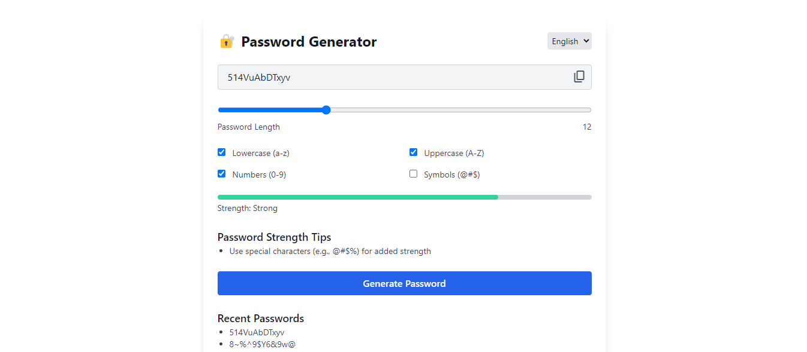
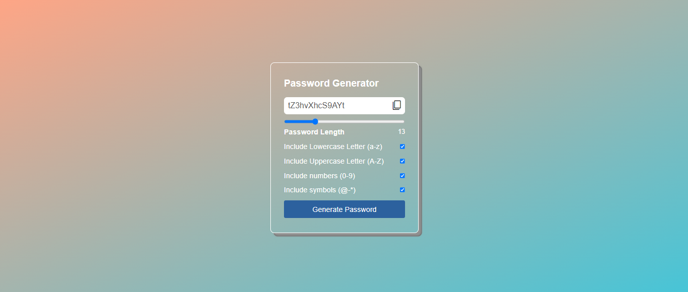

# 🔐 Password Generator

A simple, responsive password generator built with HTML, JavaScript, and Tailwind CSS. Create secure passwords with customizable options and switch between English and Bengali languages.

*New UI – Modern, sleek and fully responsive with Tailwind CSS*\


*Old UI – Classic and basic interface*

---

## বাংলা ওভারভিউ

HTML, JavaScript এবং Tailwind CSS দিয়ে তৈরি একটি সহজ, রেসপনসিভ পাসওয়ার্ড জেনারেটর। কাস্টমাইজযোগ্য অপশন সহ নিরাপদ পাসওয়ার্ড তৈরি করুন এবং ইংরেজি ও বাংলা ভাষার মধ্যে সুইচ করুন।

## Key Features

- Generate passwords with lowercase, uppercase, numbers, and symbols.
- Password strength indicator (Weak to Very Strong).
- Dynamic strength tips to improve password security.
- Save and view up to 5 recent passwords.
- Copy password to clipboard with one click.
- Export password history as CSV.
- Supports English and Bengali languages.
- Responsive design with Tailwind CSS.

## মূল ফিচার

- লোয়ারকেস, আপারকেস, সংখ্যা এবং সিম্বল দিয়ে পাসওয়ার্ড তৈরি।
- পাসওয়ার্ডের শক্তি নির্দেশক (দুর্বল থেকে খুব শক্তিশালী)।
- পাসওয়ার্ডের নিরাপত্তা উন্নত করতে ডায়নামিক টিপস।
- সর্বশেষ ৫টি পাসওয়ার্ড সংরক্ষণ ও দেখা।
- এক ক্লিকে পাসওয়ার্ড কপি।
- পাসওয়ার্ড হিস্ট্রি CSV হিসেবে ডাউনলোড।
- ইংরেজি এবং বাংলা ভাষা সমর্থন।
- Tailwind CSS দিয়ে রেসপনসিভ ডিজাইন।

## Installation

1. Download or clone the repository:
   ```bash
   git clone https://github.com/rashaduldev/Password-Generator-Js.git
